  

  

  <a href="https://anshulraman.com">anshulraman.com</a> &nbsp;·&nbsp;
  <a href="https://www.linkedin.com/in/anshulraman06/">LinkedIn</a> &nbsp;·&nbsp;
  <a href="https://uc.joinhandshake.com/profiles/anshulraman06">Handshake</a>

  

<h3 align="center">Activity</h3>

  <!-- A+ is a custom display grade, not a calculated GitHub rank. Numbers refresh through update-stats.ps1. -->
  
  

<!-- metrics renders — generated by .github/workflows/metrics.yml, committed to the `metrics` branch -->

  
  

<!-- snake — generated by .github/workflows/snake.yml, committed to the `output` branch -->
<picture>
  <source media="(prefers-color-scheme: dark)" srcset="https://raw.githubusercontent.com/itsramananshul/itsramananshul/output/github-snake-dark.svg">
  
</picture>
